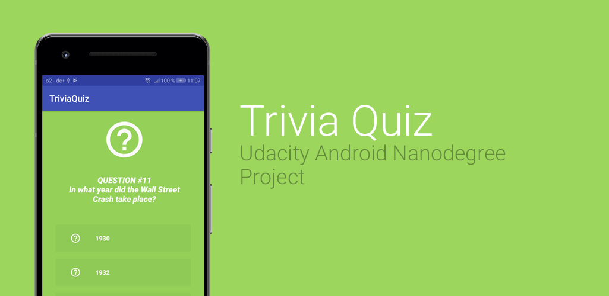

# TriviaQuiz
My Capstone Project for the Udacity Android Nanodegree

### Features
Uses Google Play Services, Admob, Widget, Room, LiveData. 
- Used Libraries:
  - [Butterknife](http://jakewharton.github.io/butterknife)
  - [Timber](https://github.com/JakeWharton/timber)
  - [Konfetti](https://github.com/DanielMartinus/konfetti)
  - [Volley](https://github.com/google/volley)
  - [GSON](https://github.com/google/gson)
  
Get the Trivia Data from the [Open Trivia DB](http://www.opentdb.com)

>Fake keystore (kestore.jks) was provided for testing!

### Final Version
Changes are done after passing the Nanodegree
- Removed
  - Google Play Services
  - Admob Banner Ads
  - Widget
- Changed the About Dialog
- Updated the Libraries
